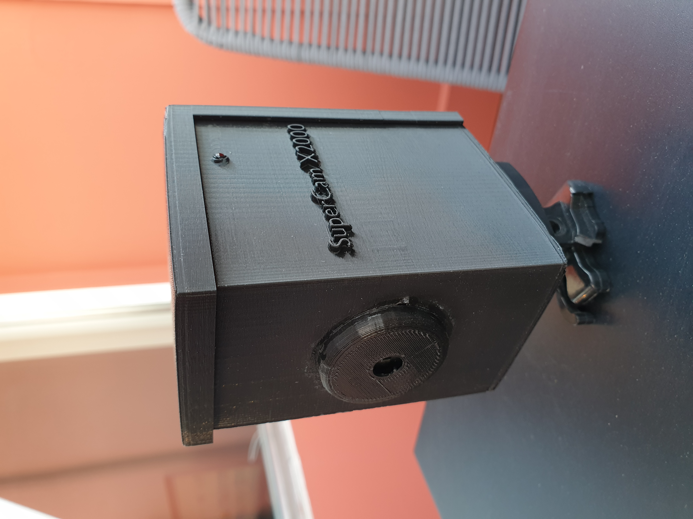

# Surveillance Camera

This project is a DIY WiFi surveillance camera with a Raspberry Pi.
It takes an image and samples temperature and humidity every ~10 minutes and stores it to a database.
Works like a charm.

The case is 3D-printed :)

